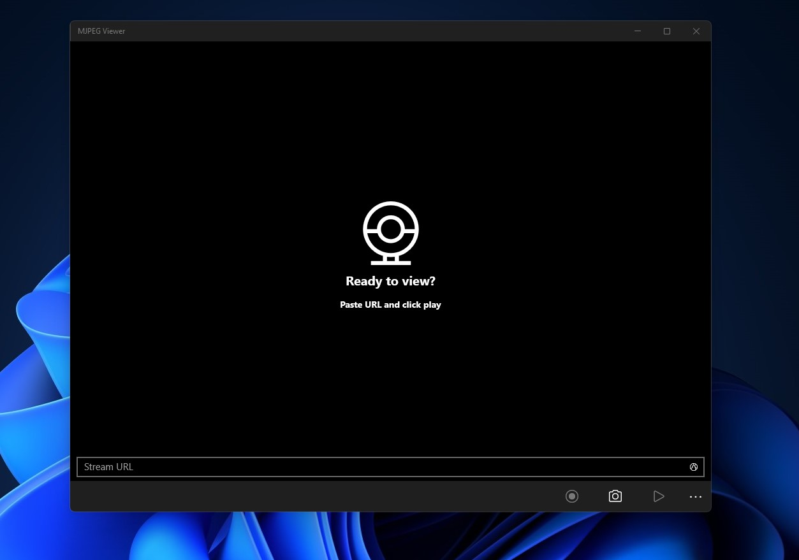

   
  <b>Simple MJPEG (UWP) created to as client for the MJPEG Streamer</b> 
  <a href="./src">Source</a>
    
    

# Features

- Capture Image
- Capture Sequence images
- Links history
- Zoom option

# Target

It will work with build 14393 and above, ARM - x64 - x86

# Credits

Developed by Bashar Astifan